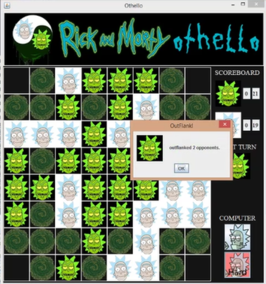

# rick-and-morty-othello
 An implementation of the game Othello or Reversi in Java, with a Rick and Morty theme. 
 Features an option to let an AI play. This uses minimax search with alpha-beta pruning.
 To run the program, run OthelloGUI.java.
 Press one of the "computer" buttons to let the algorithm make the current move for the current player. 

